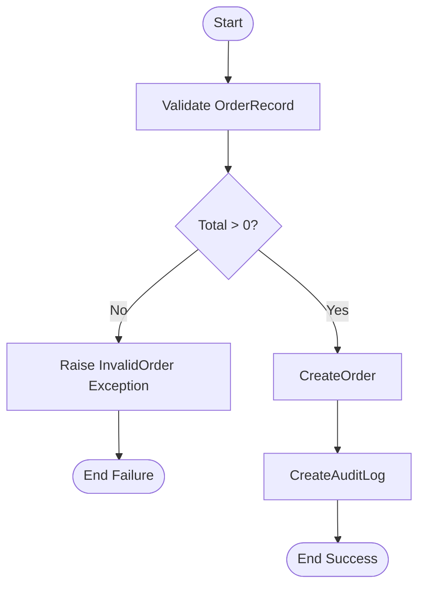
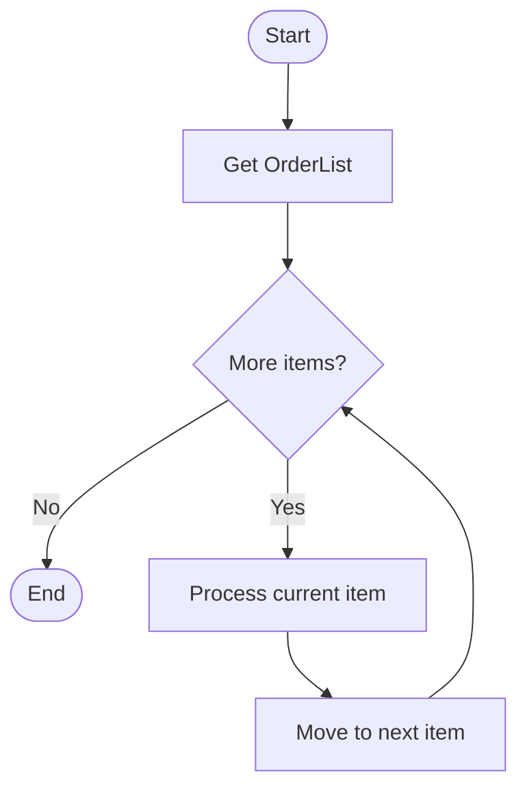
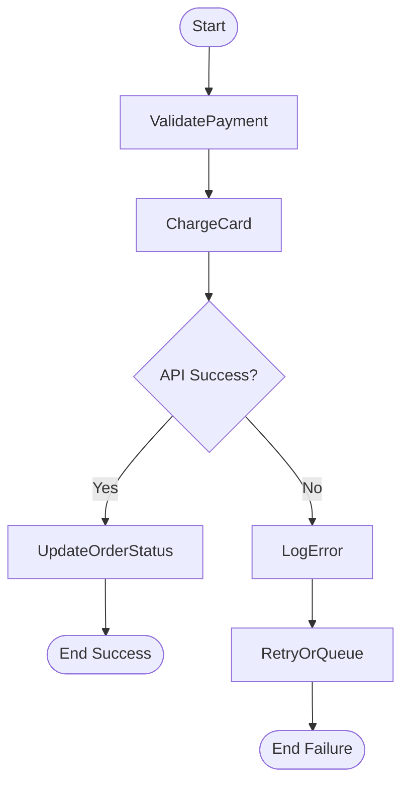

# OutSystems Logic Skill

## Action Types

OutSystems has four types of actions. Choose the right one based on where the logic runs and what it accesses.

### Client Action
- **Runs on**: Browser / mobile device
- **Use for**: UI interactions, local validation, navigation, screen state changes
- **Can access**: Local storage, client variables, JavaScript, UI widgets
- **Cannot access**: Server database directly, server-side APIs
- **Performance**: Instant (no server round-trip)

```
ClientAction: ValidateForm
  If Form.Username = ""
    FeedbackMessage("Username is required", "error")
    Return
  End If
  If Length(Form.Password) < 8
    FeedbackMessage("Password must be at least 8 characters", "error")
    Return
  End If
  // Proceed
```

### Server Action
- **Runs on**: Server
- **Use for**: Database operations, business rules, server-side validation, calling external APIs
- **Can access**: Database entities, site properties, server-side APIs, timers, BPT
- **Cannot access**: UI widgets, client variables, local storage
- **Performance**: Requires server round-trip

```
ServerAction: CreateOrder
  Input: OrderRecord (Order type)
  Output: OrderId (Long Integer)

  // Validate
  If OrderRecord.Total <= 0
    Raise Exception "InvalidOrder" with "Total must be positive"
  End If

  // Create
  CreateOrder(OrderRecord)
  OrderId = OrderRecord.Id

  // Audit
  CreateAuditLog(Action: "CreateOrder", EntityId: OrderId)
```

### Service Action
- **Runs on**: Server (exposed as internal API)
- **Use for**: Reusable logic shared across modules, module-to-module communication
- **Can access**: Same as Server Action
- **Key difference**: Runs in an independent transaction (separate from the caller)
- **O11**: Available in Service modules
- **ODC**: Available in all server modules (Services concept is default)

### Data Action
- **Runs on**: Server, triggered automatically by screens
- **Use for**: Fetching data for screen consumption
- **Can access**: Database, Server Actions, aggregates
- **Key feature**: Runs asynchronously — screen renders immediately, data loads in background
- **Output**: Automatically available to screen widgets via data binding

```
DataAction: GetDashboardData
  Output: KPIs (KPIDashboard type)
  Output: RecentOrders (Order List)

  // Aggregate: GetKPIs
  KPIs.TotalOrders = Count(Orders)
  KPIs.Revenue = Sum(Orders.Total)

  // Aggregate: GetRecentOrders (Max Records: 10, Sort: CreatedDate DESC)
  RecentOrders = GetRecentOrders.List
```

## Screen Lifecycle Events (Reactive Web / Mobile)

Events fire in this order during screen load:

```
1. OnInitialize      — First. Set default values, initialize variables. Runs BEFORE data fetch.
2. [Data Actions]    — Automatic. All Data Actions run in parallel after OnInitialize.
3. OnReady           — After first render + data load. DOM is available. Start JS interop here.
4. OnRender          — After every re-render (data change, variable change). Use sparingly.
5. OnDestroy         — Screen is being removed. Clean up timers, subscriptions.
6. OnParametersChanged — Input parameters changed (e.g., navigated to same screen with different ID).
```

### Rules
- `OnInitialize`: No DOM access. No async calls. Fast synchronous setup only.
- `OnReady`: Safe to call JavaScript, initialize third-party widgets.
- `OnRender`: Fires frequently. Never put heavy logic or Server Action calls here.
- `OnDestroy`: Clean up any `setInterval`, event listeners, or subscriptions.
- `OnParametersChanged`: Re-fetch data if the screen's input parameter changed. Check `If OldParam <> NewParam`.

## Data Types

### Basic Types
| Type | Description | Default Value |
|------|-------------|---------------|
| `Text` | String, unlimited length | `""` |
| `Integer` | 32-bit signed integer | `0` |
| `Long Integer` | 64-bit signed integer | `0` |
| `Decimal` | Fixed-point decimal (28 digits) | `0` |
| `Boolean` | True/False | `False` |
| `Date` | Date only (no time) | `#1900-01-01#` |
| `Time` | Time only (no date) | `#00:00:00#` |
| `DateTime` | Date + time | `#1900-01-01 00:00:00#` |
| `Binary Data` | Byte array / blob | `""` (empty) |
| `Phone Number` | Text formatted as phone | `""` |
| `Email` | Text formatted as email | `""` |
| `Currency` | Alias for Decimal | `0` |

### Compound Types
| Type | Description |
|------|-------------|
| `Record` | Single row of an entity or structure |
| `List` | Collection of records |
| `Structure` | Custom compound type (like a DTO) |
| `Entity` | Database-backed record type |
| `Static Entity` | Enum-like fixed set of records |

### Identifier Types
- `EntityName Identifier` — Typed foreign key (e.g., `Customer Identifier` = the Id type of Customer entity)
- `NullIdentifier()` — Returns the null/empty value for any identifier type

## Expressions

OutSystems expressions are used in widget values, conditions, assignments, and calculated attributes.

### Operators
| Operator | Description |
|----------|-------------|
| `+`, `-`, `*`, `/` | Arithmetic |
| `=`, `<>` | Equality / inequality |
| `>`, `<`, `>=`, `<=` | Comparison |
| `and`, `or`, `not` | Logical |
| `+` | String concatenation (Text type) |
| `like` | Pattern matching (SQL-style `%` wildcards) |

### Common Expression Patterns
```
// Conditional (inline IF)
If(Order.Status = "Shipped", "✓ Delivered", "Pending")

// Null check
If(Customer.Name = "", "Unknown", Customer.Name)

// Date formatting
FormatDateTime(CurrDateTime(), "yyyy-MM-dd HH:mm")

// Number formatting
FormatDecimal(Price, 2, ",", ".")

// String operations
ToUpper(Name)
Trim(Input)
Length(Description)
Substr(Text, 0, 100) + If(Length(Text) > 100, "...", "")

// Type conversion
IntegerToText(Count)
TextToInteger(Input)
IntegerToBoolean(Value)

// List operations
ListLength(Orders)
ListSort(Orders, Order.CreatedDate, ascending: False)
ListFilter(Orders, Order.Total > 100)
ListAny(Orders, Order.Status = "Pending")
ListAll(Orders, Order.IsValid)
ListIndexOf(Orders, Order.Id = TargetId)
```

## Exception Handling

### Exception Hierarchy
```
AllExceptions
├── User Exception          — Business rule violations (custom)
├── Database Exception      — DB constraint violations, connection errors
├── Security Exception      — Authorization failures, CSRF
├── Communication Exception — External API timeouts, HTTP errors
└── Abort Activity Change   — BPT-specific (O11)
```

### Pattern: Try/Catch in Server Action
```
ServerAction: ProcessPayment
  Start
    ├── Call: ValidatePayment
    ├── Call: ChargeCard (external API)
    ├── Call: UpdateOrderStatus
    └── End

  Exception Handler: CommunicationException
    ├── LogError("Payment API failed: " + ExceptionMessage)
    ├── Call: RetryOrQueue
    └── Raise User Exception "Payment failed. Please try again."

  Exception Handler: DatabaseException
    ├── LogError("DB error in ProcessPayment: " + ExceptionMessage)
    └── Raise User Exception "Unable to process. Contact support."

  Exception Handler: AllExceptions
    ├── LogError("Unexpected error: " + ExceptionMessage)
    └── Raise User Exception "Something went wrong."
```

### Rules
- Catch **specific** exceptions before general ones.
- **Always log** the original exception message before raising a user-friendly one.
- In Client Actions, use `FeedbackMessage` pattern instead of raising exceptions.
- **Never swallow exceptions silently** (empty catch block).
- Database exceptions in a Server Action abort the transaction — handle accordingly.

## Flowchart Format (.flowchart.md)

When documenting action logic as a flowchart, create a `.flowchart.md` file using Mermaid `flowchart TD` syntax. Use only four node shapes:

| Shape | Syntax | Use for |
|-------|--------|---------|
| Start | `([Start])` | Entry point of the action |
| End | `([End])` or `([End Success])` | Terminal node (label the outcome) |
| Process | `[Step name]` | Any operation — assignments, calls, queries |
| Decision | `{Condition?}` | Branching — if/else, loops, switches |

Loops and switches are represented as `{Decision}` nodes with labeled edges looping back.

### Example: Server Action flowchart



### Example: Loop pattern



### Example: Exception handling



## Reference Loading

For detailed reference material on built-in functions, system libraries, and system actions, load these files on demand:

- **Built-in functions** (10 categories, 200+ functions): Load [references/builtin-functions.md](references/builtin-functions.md) if the user mentions type conversion, date math, text manipulation, formatting, or math functions
- **Libraries** (12 modules with utility functions): Load [references/libraries.md](references/libraries.md) if the user mentions BinaryData, DateTime, HTTP, JSON, Sanitization, Security, Text, or URL utilities
- **System actions** (Authentication, User management): Load [references/system-actions.md](references/system-actions.md) if the user mentions login, logout, user creation, role management, session, or authentication

## Validation

After designing action logic, verify:
1. The correct action type is chosen (Client for UI, Server for DB/API, Data for screen data fetching)
2. Server Actions are not called from OnRender — use Data Actions or event handlers instead
3. Exception handlers catch specific exceptions before `AllExceptions`
4. No empty catch blocks — every handler logs the original `ExceptionMessage`
5. Data Actions do not depend on each other’s output (they run in parallel)
6. Lists are duplicated with `ListDuplicate` before modification if the original must be preserved

If any check fails, fix the design before presenting the output.

## Gotchas

1. **Client vs Server**: Never call Server Actions directly from OnRender. Use Data Actions for data fetching and explicit button/event handlers for mutations.
2. **Transaction scope**: Each Server Action runs in a single database transaction. If it fails partway, everything rolls back. Service Actions run in their own transaction.
3. **Async Data Actions**: Data Actions run in parallel. Do NOT depend on one Data Action's output in another. If you need sequential fetches, chain them inside a single Data Action.
4. **List by reference**: Lists are passed by reference in OutSystems. Modifying a list inside a called action modifies the original. Use `ListDuplicate` if you need a copy.
5. **Static Entity access**: Use `Entities.StaticEntityName.RecordName` to reference a specific value. Never hard-code the Id integer.
6. **Site Properties vs Client Variables**: Site Properties (O11) / Settings (ODC) are server-side configuration. Client Variables are per-session, client-side state. Don't confuse them.
7. **Timer/BPT**: In O11, Timers and BPT processes run in their own transaction context. They have no screen context — no client variables, no session.
8. **ODC differences**: ODC has no Timers or BPT. Use ODC's native scheduled jobs and event-driven architecture instead.
